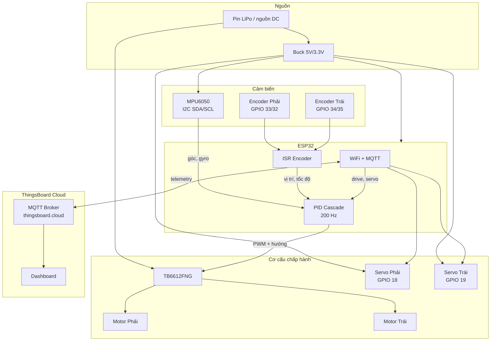
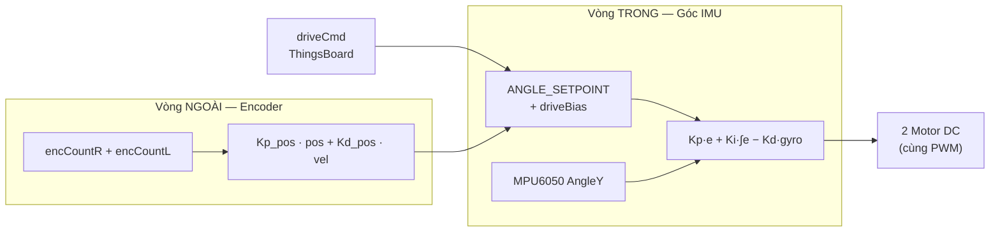
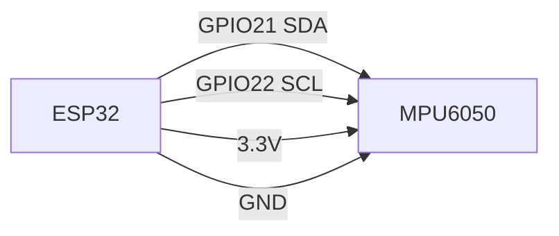
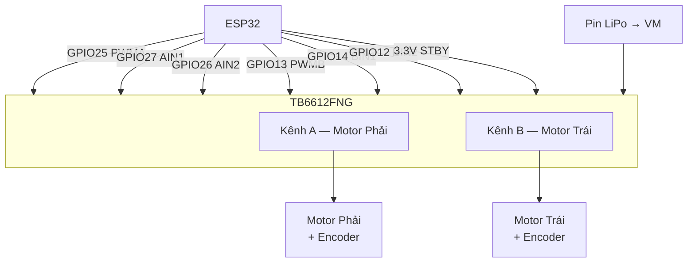
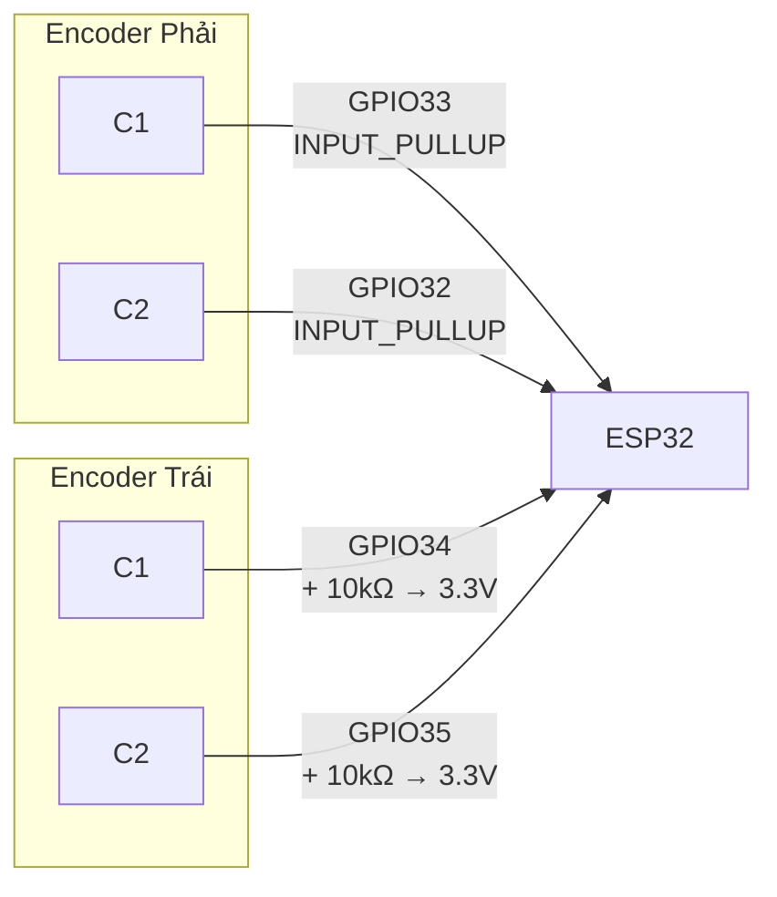
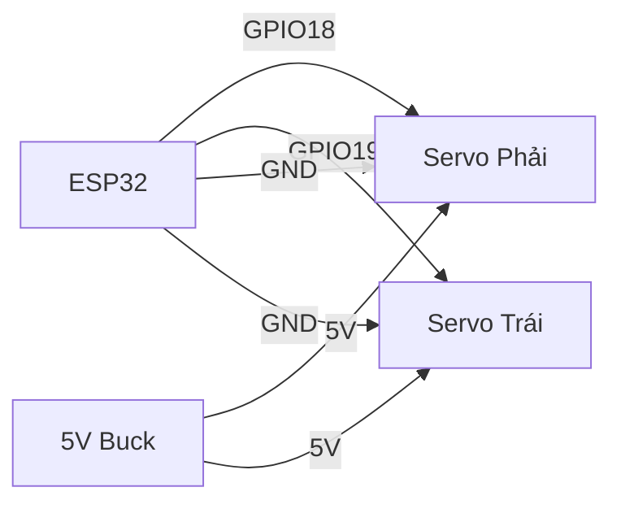

# Xe Tự Cân Bằng 2 Bánh — ESP32 + MPU6050 + TB6612FNG

Robot tự cân bằng (inverted pendulum) trên 2 bánh, điều khiển bằng **PID lồng nhau** (cascade), kết nối **ThingsBoard Cloud** qua WiFi/MQTT để điều khiển từ xa và theo dõi telemetry.

---

## 1. Tổng quan hệ thống

| Thành phần | Mô tả |
|-----------|-------|
| Vi điều khiển | ESP32 (Dev Module) |
| IMU | MPU6050 / MPU9250 (I2C) — đo góc nghiêng & vận tốc góc |
| Driver motor | TB6612FNG (2 kênh H-bridge) |
| Động cơ | 2 motor DC giảm tốc **có encoder** (trái + phải) |
| Encoder | Quadrature encoder gắn trên trục motor |
| Servo | 2 servo (chân phải GPIO18, chân trái GPIO19) |
| IoT | ThingsBoard Cloud — MQTT Shared Attributes + Telemetry |
| Thuật toán | PID góc (vòng trong) + PID vị trí/tốc độ encoder (vòng ngoài) |

### Sơ đồ khối hệ thống



### Luồng điều khiển (Cascade PID)



- **Vòng trong (PID góc):** Giữ thân xe đứng thẳng — quan trọng nhất.
- **Vòng ngoài (PID vị trí):** Chống xe trôi/chúi một hướng (hiện tạm tắt do encoder 2 bên đếm ngược dấu).
- **driveCmd:** Lệnh tiến/lùi từ ThingsBoard → nghiêng nhẹ điểm cân bằng (`MAX_DRIVE_TILT`).

---

## 2. Danh sách linh kiện

| STT | Linh kiện | Số lượng | Ghi chú |
|-----|-----------|----------|---------|
| 1 | ESP32 Dev Module | 1 | WiFi tích hợp |
| 2 | MPU6050 (hoặc MPU9250) | 1 | Gắn cố định trên thân xe |
| 3 | Module TB6612FNG | 1 | Driver 2 kênh, PWM 20 kHz |
| 4 | Motor DC giảm tốc + encoder | 2 | Trái & phải |
| 5 | Servo (MG996R hoặc tương đương) | 2 | Chân co duỗi |
| 6 | Trở kéo 10 kΩ | 2 | Bắt buộc cho GPIO34, GPIO35 |
| 7 | Pin LiPo 2S/3S + mạch sạc | 1 | Cấp VM cho motor |
| 8 | Buck DC-DC 5V/3.3V | 1 | Cấp ESP32, MPU, servo |
| 9 | Tụ lọc 100 µF | 1–2 | Gần TB6612 VM |
| 10 | Dây Dupont, breadboard/PCB | — | |

> **Lưu ý nguồn:** Motor và servo tiêu thụ dòng lớn — nên tách nguồn logic (3.3 V) và nguồn công suất (VM motor, 5 V servo). **GND phải nối chung** giữa tất cả module.

---

## 3. Sơ đồ mạch — Bảng chân ESP32

| Chức năng | Chân ESP32 | Kết nối tới |
|-----------|-----------|-------------|
| I2C SDA | **GPIO 21** | MPU6050 SDA |
| I2C SCL | **GPIO 22** | MPU6050 SCL |
| Motor Phải PWM | **GPIO 25** | TB6612 PWMA |
| Motor Phải IN2 | **GPIO 26** | TB6612 AIN2 |
| Motor Phải IN1 | **GPIO 27** | TB6612 AIN1 |
| Motor Trái PWM | **GPIO 13** | TB6612 PWMB |
| Motor Trái BIN1 | **GPIO 14** | TB6612 BIN1 |
| Motor Trái BIN2 | **GPIO 12** | TB6612 BIN2 |
| Encoder Phải C1 | **GPIO 33** | Encoder phải kênh A (pull-up nội) |
| Encoder Phải C2 | **GPIO 32** | Encoder phải kênh B (pull-up nội) |
| Encoder Trái C1 | **GPIO 34** | Encoder trái kênh A + **trở 10k → 3.3V** |
| Encoder Trái C2 | **GPIO 35** | Encoder trái kênh B + **trở 10k → 3.3V** |
| Servo Phải | **GPIO 18** | Tín hiệu servo phải |
| Servo Trái | **GPIO 19** | Tín hiệu servo trái |
| TB6612 STBY | **3.3 V** | Luôn HIGH (cho phép driver) |

---

## 4. Sơ đồ mạch chi tiết

### 4.1 Sơ đồ tổng thể (ASCII)

```
                         ┌─────────────────────────────────────────┐
                         │              ESP32                       │
                         │                                         │
    ┌──────────┐  I2C    │  GPIO21(SDA) ──────┐                    │
    │ MPU6050  │◄───────►│  GPIO22(SCL) ──────┤                    │
    │  3.3V    │         │                    │                    │
    └──────────┘         │  GPIO25 ───────────┼──► PWMA            │
                         │  GPIO26 ───────────┼──► AIN2   ┌────────┴───────┐
                         │  GPIO27 ───────────┼──► AIN1   │   TB6612FNG    │
                         │                    │           │                │
                         │  GPIO13 ───────────┼──► PWMB   │  STBY ──► 3.3V │
                         │  GPIO14 ───────────┼──► BIN1   │  VM  ◄── Pin   │
                         │  GPIO12 ───────────┼──► BIN2   │  GND ◄── GND   │
                         │                    │           │                │
                         │  GPIO33 ◄──────────┼─── Enc-R C1 (pull-up nội) │
                         │  GPIO32 ◄──────────┼─── Enc-R C2              │
                         │  GPIO34 ◄──────────┼─── Enc-L C1 + 10k→3.3V  │
                         │  GPIO35 ◄──────────┼─── Enc-L C2 + 10k→3.3V  │
                         │                    │           │                │
                         │  GPIO18 ───────────┼───────────┼──► Servo Phải  │
                         │  GPIO19 ───────────┼───────────┼──► Servo Trái  │
                         │  3.3V / GND        │           │                │
                         └────────────────────┘           │  AO1/AO2 ─ Motor Phải
                                                          │  BO1/BO2 ─ Motor Trái
                                                          └────────────────┘

    Nguồn:
    ┌─────────┐     ┌──────────┐
    │ LiPo    │────►│ TB6612   │  VM (7–12 V tùy motor)
    │ 2S/3S   │     │   VM     │
    └─────────┘     └──────────┘
         │
         └────────► Buck 5V ──► ESP32 VIN / Servo VCC
                    Buck 3.3V ─► ESP32 3.3V, MPU6050, TB6612 VCC (logic)
```

### 4.2 MPU6050 (I2C)



| MPU6050 | ESP32 |
|---------|-------|
| VCC | 3.3 V |
| GND | GND |
| SDA | GPIO 21 |
| SCL | GPIO 22 |

> Gắn MPU6050 **cố định trên thân robot**, trục đo góc phải trùng hướng nghiêng tới/lui của xe (`BALANCE_AXIS_Y = 1` → dùng `AngleY`).

### 4.3 TB6612FNG + 2 Motor DC



| TB6612FNG | ESP32 / Nguồn |
|-----------|---------------|
| PWMA | GPIO 25 |
| AIN1 | GPIO 27 |
| AIN2 | GPIO 26 |
| PWMB | GPIO 13 |
| BIN1 | GPIO 14 |
| BIN2 | GPIO 12 |
| STBY | 3.3 V (cố định HIGH) |
| VCC | 3.3 V (logic) |
| VM | Pin LiPo (qua tụ lọc) |
| GND | GND chung |
| AO1, AO2 | Motor phải |
| BO1, BO2 | Motor trái |

**Logic điều khiển chiều quay (từ firmware):**

| Hướng | IN1 / BIN1 | IN2 / BIN2 | PWM |
|-------|-----------|-----------|-----|
| Tiến | HIGH | LOW | 0–255 |
| Lùi | LOW | HIGH | 0–255 |

PWM: **20 kHz**, 8-bit (0–255).

### 4.4 Encoder quang (2 bánh)



| Encoder | Kênh | GPIO | Pull-up |
|---------|------|------|---------|
| Phải | C1 (xung) | 33 | Nội ESP32 (`INPUT_PULLUP`) |
| Phải | C2 (chiều) | 32 | Nội ESP32 |
| Trái | C1 (xung) | 34 | **Trở 10 kΩ ngoài → 3.3 V** |
| Trái | C2 (chiều) | 35 | **Trở 10 kΩ ngoài → 3.3 V** |

> GPIO 34 và 35 trên ESP32 **chỉ là INPUT**, không có trở kéo nội — bắt buộc gắn trở kéo lên 10 kΩ.

Ngắt đếm: cạnh **RISING** trên C1, đọc C2 để xác định chiều quay.

### 4.5 Servo (2 chân co duỗi)



| Servo | GPIO | Góc |
|-------|------|-----|
| Phải | 18 | 0°–180° (map từ 0–100 trên ThingsBoard) |
| Trái | 19 | 0°–180° |

Tín hiệu PWM: **50 Hz**, pulse 500–2400 µs.

---

## 5. Cấu trúc thư mục

```
xe-can-bang-final/
├── README.md
└── firmware-xe-can-bang/
    └── firmware-xe-can-bang.ino
```

---

## 6. Thư viện Arduino cần cài

| Thư viện | Mục đích |
|----------|----------|
| [MPU6050_tockn](https://github.com/tockn/MPU6050_tockn) | Đọc góc & gyro MPU6050 |
| [ESP32Servo](https://github.com/madhephaestus/ESP32Servo) | Điều khiển servo trên ESP32 |
| [PubSubClient](https://github.com/knolleary/pubsubclient) | MQTT client |
| [ArduinoJson](https://arduinojson.org/) ≥ 6.x | Parse JSON ThingsBoard |

**Cài đặt board:** ESP32 Dev Module, Upload speed 921600, CPU 240 MHz.

---

## 7. Cấu hình WiFi / ThingsBoard

Sửa trong `firmware-xe-can-bang.ino`:

```cpp
#define WIFI_SSID     "iot"
#define WIFI_PASS     "12345678"
#define TB_SERVER     "thingsboard.cloud"
#define TB_PORT       1883
#define TB_TOKEN      "<device-access-token>"
```

Token lấy tại: ThingsBoard → Device → **Access token**.

---

## 8. Điều khiển qua ThingsBoard

### 8.1 Shared Attributes (gửi xuống thiết bị)

| Key | Kiểu | Phạm vi | Mô tả |
|-----|------|---------|-------|
| `drive` | float | -100 … 100 | Tiến (+) / lùi (-). 0 = đứng yên. Nghiêng điểm cân bằng tối đa `MAX_DRIVE_TILT` (4°) |
| `servoRight` | int | 0 … 100 | Góc servo phải (map → 0°–180°) |
| `servoLeft` | int | 0 … 100 | Góc servo trái (map → 0°–180°) |

**Ví dụ payload:**

```json
{
  "drive": 50,
  "servoRight": 80,
  "servoLeft": 20
}
```

### 8.2 Telemetry (gửi lên mỗi 1 giây)

| Key | Mô tả |
|-----|-------|
| `angle` | Góc nghiêng hiện tại (°) |
| `drive` | Lệnh drive đang áp dụng |
| `balancing` | 1 = đang cân bằng, 0 = tắt (xe ngã hoặc chưa sẵn sàng) |

---

## 9. Thông số PID & tinh chỉnh (TUNE)

Các hằng số quan trọng trong firmware:

| Tham số | Giá trị mặc định | Ý nghĩa |
|---------|------------------|---------|
| `BALANCE_AXIS_Y` | 1 | Dùng trục Y làm góc cân bằng |
| `ANGLE_SETPOINT` | 1.0° | Điểm cân bằng khi xe đứng thẳng |
| `FALL_LIMIT` | 45° | Ngã quá ngưỡng → tắt motor |
| `Kp` | 15.0 | PID góc — tỷ lệ |
| `Ki` | 0.0 | PID góc — tích phân |
| `Kd` | 2.5 | PID góc — vi phân (từ gyro) |
| `Kp_pos` | 0.0 | PID vị trí — **tạm tắt** |
| `Kd_pos` | 0.0 | PID tốc độ — **tạm tắt** |
| `DT_MS` | 5 ms | Chu kỳ vòng điều khiển (200 Hz) |

### Chỉnh PID realtime qua Serial Monitor (115200 baud)

| Lệnh | Ví dụ | Tác dụng |
|------|-------|----------|
| `p` + số | `p12` | Đặt Kp = 12 |
| `i` + số | `i0.3` | Đặt Ki = 0.3 |
| `d` + số | `d2.5` | Đặt Kd = 2.5 |
| `s` + số | `s1.0` | Đặt ANGLE_SETPOINT = 1.0° |
| `?` | `?` | In tất cả giá trị hiện tại |

### Quy trình dò PID góc (vòng trong)

1. Đặt `Ki = 0`, `Kd = 0`.
2. Tăng `Kp` từ từ cho đến khi xe rung quanh thẳng đứng.
3. Tăng `Kd` để dập rung.
4. Thêm `Ki` nhỏ để hết trôi góc.
5. Đo `ANGLE_SETPOINT` khi giữ xe đứng cân bằng thật (thường ~1°).

### Đảo chiều motor / encoder

Nếu 1 bánh tiến 1 bánh lùi, sửa trong code:

```cpp
#define MOTOR_R_SIGN  1   // đổi 1 ↔ -1
#define MOTOR_L_SIGN -1   // đổi 1 ↔ -1
#define ENC_R_SIGN 1
#define ENC_L_SIGN -1
```

Sau khi 2 encoder đếm **cùng dấu** khi xe đi thẳng, bật lại vòng ngoài:

```cpp
float Kp_pos = 0.003;
float Kd_pos = 0.030;
```

---

## 10. Hướng dẫn nạp firmware & test

### Bước 1 — Lắp mạch

1. Kiểm tra GND chung giữa ESP32, TB6612, MPU6050, encoder, servo.
2. Gắn trở 10 kΩ cho GPIO 34 và 35.
3. Nối STBY TB6612 → 3.3 V.
4. Cấp nguồn VM cho motor **riêng** với logic 3.3 V.

### Bước 2 — Nạp firmware

1. Mở `firmware-xe-can-bang/firmware-xe-can-bang.ino` trong Arduino IDE.
2. Chọn board **ESP32 Dev Module**, cổng COM đúng.
3. Compile & Upload.
4. Mở Serial Monitor **115200 baud**.

### Bước 3 — Calibrate MPU6050

Khi khởi động, firmware yêu cầu:

```
>>> GIU CO DINH ROBOT - dang tinh offset gyro...
```

**Giữ robot cố định, không chạm** trong lúc calibrate gyro.

### Bước 4 — Bắt đầu cân bằng

1. Đặt xe gần thẳng đứng (trong ±3°).
2. Serial hiện `Bal: ON` khi bắt đầu cân bằng.
3. Nếu xe ngã quá 45° → `Bal: OFF`, motor tắt an toàn.

### Bước 5 — Test ThingsBoard

1. Kiểm tra Serial: `MQTT ThingsBoard: CONNECTED`.
2. Gửi shared attribute `drive: 30` → xe nghiêng nhẹ và tiến.
3. Gửi `servoRight: 50`, `servoLeft: 50` → 2 servo quay giữa.

---

## 11. Xử lý sự cố

| Triệu chứng | Nguyên nhân có thể | Cách xử lý |
|-------------|-------------------|------------|
| Xe không cân bằng, ngã ngay | Kp quá thấp / setpoint sai | Tăng Kp, đo lại `ANGLE_SETPOINT` |
| Xe rung mạnh | Kp quá cao / Kd thấp | Giảm Kp, tăng Kd |
| 1 bánh tiến, 1 bánh lùi | Dấu motor sai | Đổi `MOTOR_R_SIGN` hoặc `MOTOR_L_SIGN` |
| Encoder trái không đếm | Thiếu trở kéo GPIO34/35 | Gắn 10 kΩ lên 3.3 V |
| Encoder 2 bên ngược dấu | Chiều lắp encoder | Đổi `ENC_R_SIGN` / `ENC_L_SIGN` |
| Motor kêu rít | PWM tần số thấp | Firmware dùng 20 kHz — kiểm tra `ledcAttach` |
| MQTT không kết nối | Sai token / WiFi | Kiểm tra `TB_TOKEN`, SSID/password |
| Servo giật | Dòng 5 V yếu | Dùng nguồn 5 V riêng, GND chung |
| Góc đọc sai trục | MPU lắp sai hướng | Đổi `BALANCE_AXIS_Y` (0 = X, 1 = Y) |

---

## 12. An toàn

- Luôn test với xe **đặt trên giá đỡ** hoặc bắt tay trước khi thả tay.
- Khi `|góc - setpoint| > 45°`, firmware **tự tắt motor** (`FALL_LIMIT`).
- Không để pin LiPo xả cạn — dùng BMS hoặc báo pin thấp.
- Tụ lọc gần TB6612 VM để tránh sụt áp khi motor khởi động.

---

## 13. Tóm tắt sơ đồ nối dây nhanh

```
ESP32 GPIO21/22  ── I2C ──►  MPU6050
ESP32 GPIO25-27  ────────►  TB6612 kênh A (Motor Phải)
ESP32 GPIO12-14  ────────►  TB6612 kênh B (Motor Trái)
ESP32 GPIO33/32  ◄────────  Encoder Phải (pull-up nội)
ESP32 GPIO34/35  ◄────────  Encoder Trái (+ 10kΩ pull-up)
ESP32 GPIO18/19  ────────►  Servo Phải / Trái
TB6612 STBY      ────────►  3.3V
TB6612 VM        ◄────────  Pin LiPo
ESP32 + MPU      ◄────────  3.3V (Buck)
Servo            ◄────────  5V (Buck)
Tất cả GND       ────────►  GND chung
```
